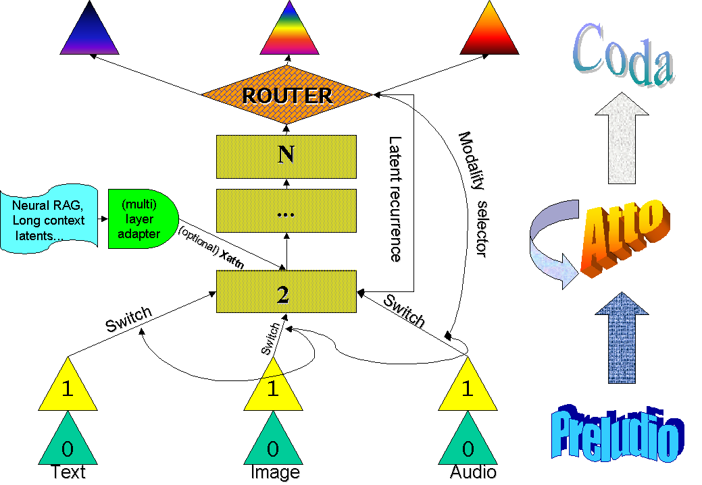
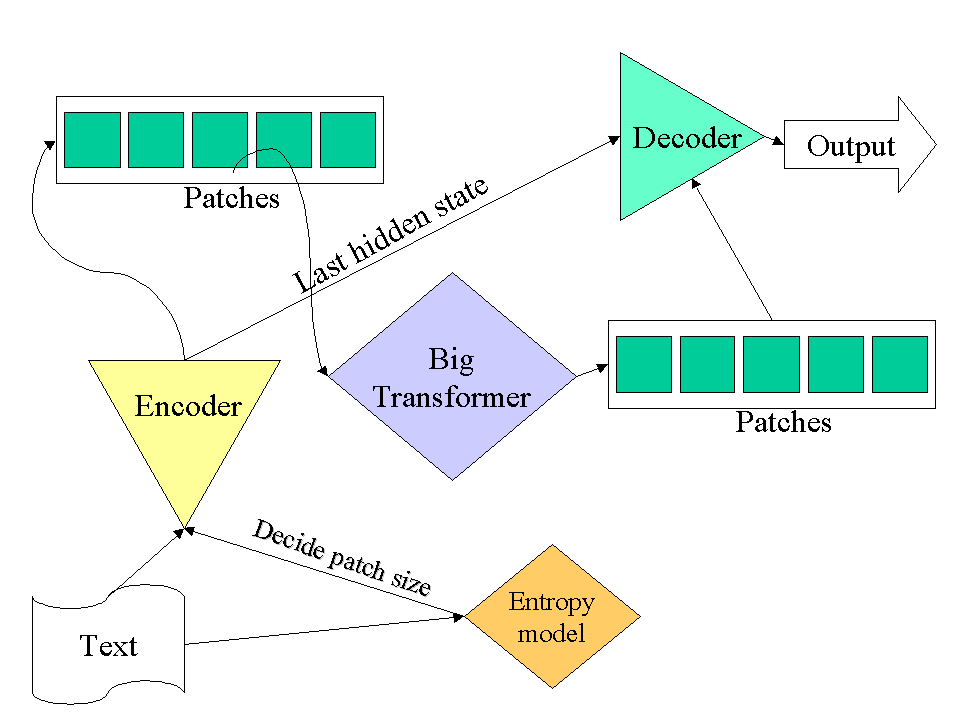

# Matformer: a unified any-to-any autoregressive and diffusion model

### *This is not the readme of the “matformer” library. That is still missing (but, read “note\_ \_codice.md”), this is a draft presentation of a new architecture that should be built using the matformer library.*

**

## Disclaimer: this is not an academic paper!

This document is only a presentation of the project to the team. Even
though the style of sentences may appear academic, there are many
missing contents and references. Moreover only a small part of the
experiments is executed to date. The architecture could (and will!)
still drastically change and the following text may contain incorrect
assertions.

The name “Matformer” must be changed: “Matteo” is my name but, if and as
soon at this work will become a team-work, we need to find a new nice
name.

Fundamental works for the comprehension of this draft, such as BLT or
Coconut, are not yet introduced so the invite is to refer to the
original papers.

Consider it a bit more than a blog post but less than an arXiv draft.

## Introduction

Matformer is a novel transformer-based architecture grounded on a
fundamental assumption, that is, the development of abstract
representations in the latents of the models’ middle layers.

Mechanistic Interpretability studies showed in several occasions
\[1\],\[2\] that the Large Language Models have a tendency to dedicate
the lower layers to convert tokens into a more abstract representational
space (de-tokenization), perform the actual computations into the middle
layers and then convert back these representations into tokens at the
final layers.

As can be for example observed in \[3\], initial as well as final layers
tend to work in a subspace affine to the embedding/unembedding matrixes,
in contrast with the middle layer. Again, \[4\] studies about
multilingual capabilities of LLMs, in particular in big models, have
demonstrated the existence of neurons independent from the input
language and, consequently, they can be considered as conceptual neurons
because they perform abstractions from the specific language the model
is considering (but, see \[3\]).

Regarding multi-modality, works such as \[5\]\[6\] strengthen the idea
that such conceptual latent-space representations may also be amodal,
that is, independent not just from the specific input language but also
from the specific modality (text, audio, video, data...) vehicolating
them.

Taking those findings into consideration, the main idea of “matformer”
consists to design a model less bound to the specific input modality but
capable to work on latent-space representations generated by smaller
model aligned to the bigger model that works as adapters for each
particular modality. This could mean to have a model potentially more
aligned to some findings coming from cognitive neuroscience that applies
to the way in which human brain works; moreover, it could mean to have a
model that produces representations not bound to a specific input/output
space, a characteristic that could improve generalisation performance of
the model and performances in retrieval, memorisation and reasoning.

Another speculation that we would like to test with such a “latent
representations transformer” is that this way of representing
information may help the model to work with its own latents in a
recurrent or semi-recurrent fashion (see: \[7\],\[8\]). Adding some form
of recurrency, that has to be carefully managed in order not to lose the
performance gain given by the parallerizability typical of Transformers
models, may disclose new dimensions to improve the models’ performances
in scenarios such as long-context inputs or to move toward a
neural-fashioned RAG in which useful information are directly injected
into the model in the form of latents instead of being just added to the
prompt, an expensive operation due to the high computational costs of
Attention.

Moreover, proposed improvement to the Transformer base model such as
Coconut \[9\] fit well into this kind of design: instead of using all
the layers of the model, reasoning in latent space could be performed
only by the middle layers of the models, saving compute and reducing
noise given by the tokenization and detokenization processes.

## Modalities integration

To enable the latent representations transformer to process textual
information we decided to closely follow the idea of the Byte Latent
Transformer \[10\] but proposing a new implementation slightly different
in some technical details. We believe that an architecture such as BLT
is a natural choice for this kind of model, despite being a new and
experimental model: the design choice of BLT to separate textual encoder
and decoder as well as its working principle of feeding a global
transformer with patch derived directly from text’s characters are well
suited to fit in a model such as Matformer, being its core architectures
a transformer capable to work directly on lesser modality-constrained
patches.

Regarding audio and visual data, we decided to follow the approach of
the contemporary state-of-the-art image and audio generative models to
create patch representations starting from a Variational Autoencoder
rather than directly from raw data. Being matformer a wannabe amodal and
any-to-any model, it is necessary to find a strategy not just for
multimedial comprehension but also to generate data in these modalities
using the same, shared, central model thus avoiding approaches based on
placing separate models side by side and creating more or less
artificial communication channels between these models.

We decided to don’t follow the path of generating image and audio data
using autoregressive approaches, that are commonly employed in
generative large language models: instead, we choose denoising diffusion
as first choice for the generation of multimedia contents.

Verifying if the same transformer model is able to learn at the same
time distinct training objective such as autoregression (for text) and
denoising diffusion (audio, image, eventually video) is a rather new
path, not much explored in the literature. The point is to avoid
negative interferences but at the same time promote the formation of
positive interferences, aiming at reaching a real modality unification.
We believe that several techniques developed in the field of Mechanistic
Interpretability could be applied to such architecture to detect the
nature of these interference. Future experiments may try to test the
performance of this hybrid model employing text diffusion (as in Llada)
or text-block diffusion also for text generation in order to unify the
handling of different modalities, even though text diffusion works in a
rather different way than diffusion employed for multimedia content.

The flexibility of this conceptual model allows, at least
hypotethically, the integration into this architecture of any possible
data representable in the form of patches-splittable tensors, such as
raw data of various nature (scientific data, robotic data...) or, as we
plan to test in future work, trying to represent in a way understandable
for a neural network the “motion vectors” employed in video codecs such
as MPEG. This could open up scenarios in which video can be efficiently
generated avoiding the generation of each frame but limiting only to
generating key frames and the motion vector between them.

Finally, the concept of “entropy” that we borrowed from Meta’s BLT paper
and applied in the text encoder could be explored also to integrate
other modality to avoid the model to spend the same amount of
computation for low-informative parts of an input (as an example extreme
case, black pixels in image, background noise in the audio or headers of
a PDF) and high informative parts.

## Implementation

Realising in practice such an hybrid model requires first of all a way
to address the transformers’ residual stream into the correct direction.
A possibility consists into integrating into the global model a small
“router” model, that can be as simple as a linear probe, choosing each
time where to address the residual stream. In this way, the training
objective of the Matformer becomes double: on the one hand, to produce
the patch with the correct information, on the other, to correctly route
the flow toward the correct modality processor. The router can generate
special tokens that will influence the behaviour of the model guiding
the inference process toward the correct generation modality. Having
such a router integrated into the model can help to integrate into the
Matformer the promising “Coconut” architecture proposed by Meta: by
generating a special \<*recurrent*\> token, a situation that will be
better analysed in the following section.

## Enabling recurrence, neural RAG and, potentially, memory

At this stage of experimentation, this part is still far to be actually
defined and implemented but we still want to describe a potential
paradigm that may increase the interest in an architecture such as
Matformer. We borrowed the very nice “Preludio, Atto and Coda” names
from \[9\].

Regarding recurrence, that will be always optional both in training a
new model but also during inference, Matformer is easily compatible with
at least two different paradigms already explored in literature:

- Coconut: the router can decide to directly send the next token into
  the Atto, avoiding its passage trough the Preludio of any specific
  modality. To skip Preludio and Coda layers means that the additional
  computation/reasoning caused by the recurrence is not forced to belong
  to any specific modality, thus amodal reasoning is encouraged and
  computation is saved because the stream doesn’t have to pass through
  modality-specific layers. This behaviour could be teached to the model
  employing RL techniques.
- Standard RNN, such as \[...\]: a cross-attention layer can be easily
  added in the first(s) layers of the Atto, rendering the architecture
  ready to receive information coming from a precedent execution of the
  model. The excessive cost of BPTT can be attenuated by freezing all
  the copies of the main model and training only the adapter layers.
  During training this procedure can be parallelized with a careful
  batch preparation: if a long document is split into sequences, the
  model can be trained on the first batch of segments and at the next
  step receive the second segments as well as the pre-computed latents
  coming from the previous execution of the model. Unfortunately, giving
  to the model the entire sequence of latents may be too computational
  expensive due to the exponential costs of attention with increased
  sequence length. Because the information is already converted into a
  latent space by the previous execution of the model, interesting
  direction of experimentation could find ways to compress these latent
  tensor without losing the information relevant to lower the loss on
  the next part of the sequences. Autoencoders, Convolutions or Pooling
  could be tried to condense, for example, a number of latents
  originally as long as the original sequence to much shorter sequences
  ready to be injected in the cross-attention layer.

We believe that teaching the model to be able to work not only with
latents coming from encoder models but also with its own latents may
enable new scaling direction for the architecture. The model will no
longer be constrained to reason or retrieve information in an expensive
and limited “token” space, where for example specific grammatical
constraints must be satisfied and multiple path of thinking are more
difficult to represent \[as shown in coconut\]. A model capable to work
with its own latent is a model in a sense more “self-aware” of its own
internal mechanisms and that can be in principle more efficient: for
example, it will no longer required for RAG to inject long pieces of
information directly into the textual context, a very expensive
operation in terms of memory and computations. Instead, a neural memory
(such a QKV memory, or a Modern Hopfield Network) could directly search
into a cache of pre-computed latents, potentially in superposition
regime, and return to the model a latent similar to the prompt. We
believe that a model organised in such a way can also be more easily
adaptable to approaches such as Fast Weight or Test Time Training
\[...\], approaches that definitely should be tested in the direction of
solving one of the biggest lack of current architecture: continual
learning.

Finally, similar to what is shown in \[7\]\[11\] we expect a
recurrence-enabled model to perform very well on potentially infinite
sequence length without causing memory issues.

## Bonus

Good results obtained by others in model stitching may suggest that,
instead of initializing this model with random weights, weights from
other models (ex. merging together a LLM and a Diffusion model) could be
adapted. The BLT paper, for example, shows that Llama 3 can be easily
converted to work with a BLT layers instead of the standard tokenization
process.

## Necessary ablation studies

- Using BLT-Like scheme for text instead of standard tokenization based
  approach
- Diffusion for text
- Understand the best strategy for diffusion conditioning, that is,
  mainly integration of timestep information
- \[...\]

## Very Partial References

\[1\] Missing, but many of works on M.I. such as Neel Nanda’s

\[2\] Missing, but many of works on M.I. such as Neel Nanda’s

\[3\] Wendler, Veselovsky, Monea, West “Do Llamas Work in English? On
the Latent Language of Multilingual Transformers”, ACL Proceedings, 2024

\[4\] Lindsey et al. On the Biology of a Large Language Model,
Transformer Circuit Thread, Anthropic 2025

\[5\] Huh, Cheung, Wang, Isola “The Platonic Representation Hypothesis”,
arXiv:2405.07987 2024

\[6\] Missing but easy to find

\[7\] Bulatov, Kuratov, Burtsev “Recurrent Memory Transformer”, arXiv:
2207.06881, 2022

\[8\] Nguyen, Lin “Intra-Layer Recurrence in Transformer for Language
Modeling”, arXiv:2505.01855, 2025

\[9\] Hao et al, “Training Large Language Models to Reason in a
Continuous Latent Space”, Meta, 2024

\[10\] Pagnoni et al “Byte Latent Transformer: Patches Scale Better than
Tokens”, Meta, 2024

\[11\] Sun et al “Learning to (Learn at Test Time): RNNs with Expressive
Hidden States”, arXiv:2407.04620, 2024

## Simple Scheme of BLT Architecture:

